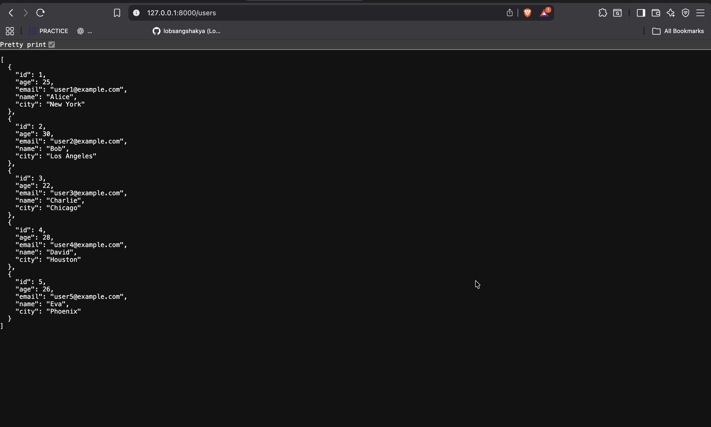
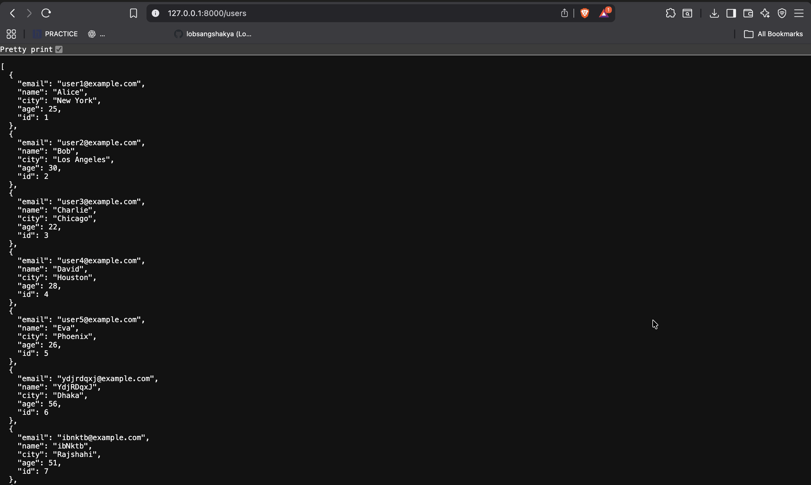

# CSV_DB_API

A beginner-friendly FastAPI project that loads data from a CSV file into a database using SQLAlchemy ORM and exposes it through REST APIs.

- CSV → Database using SQLAlchemy  
- Fetch data via FastAPI endpoints  
- Demonstrates request–response flow and ORM usage  

## Sample API Response

[Users API Response]
<!--  -->

Run locally:
uvicorn app.main:app --reload